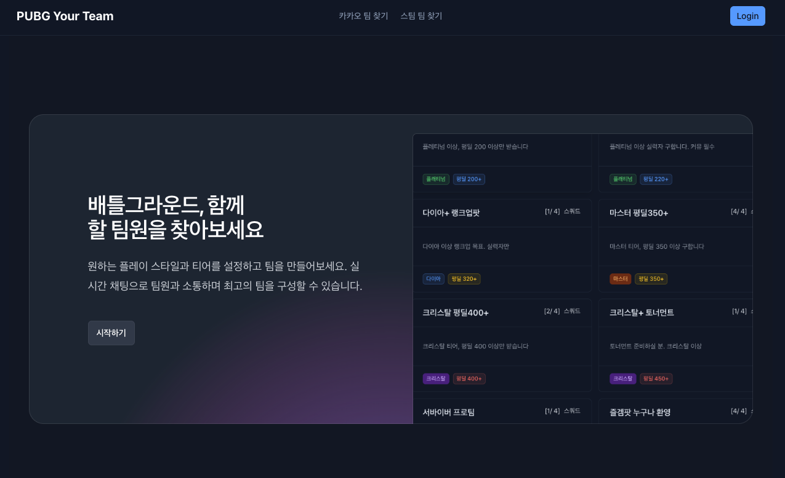
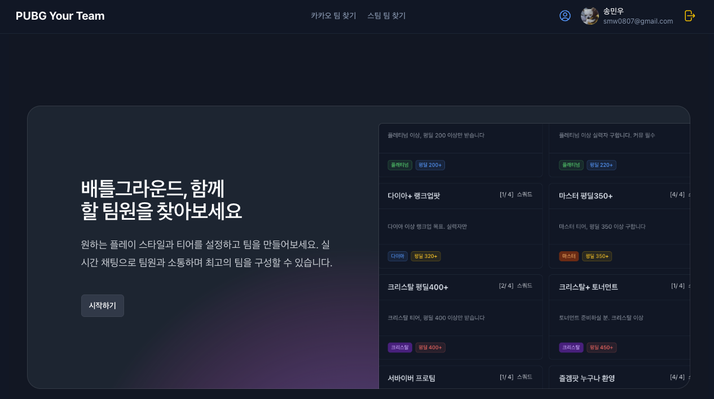
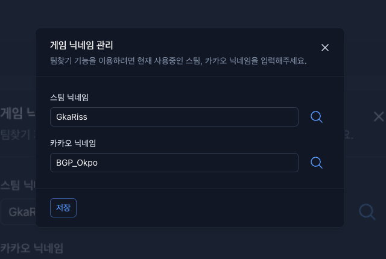
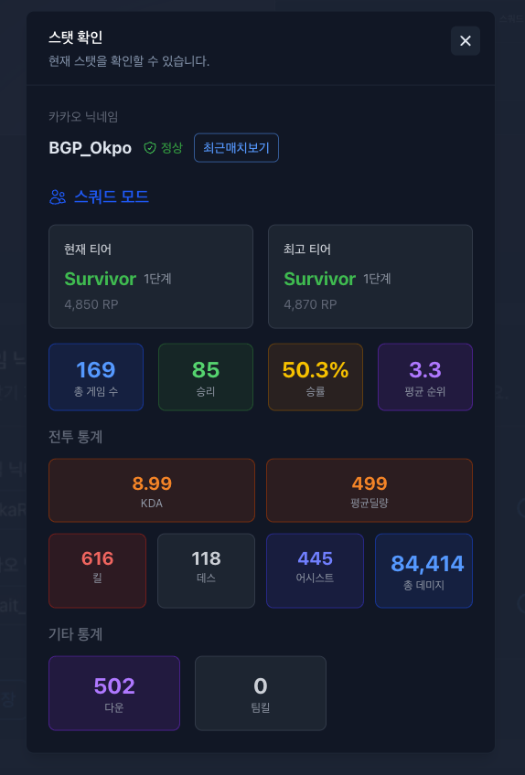
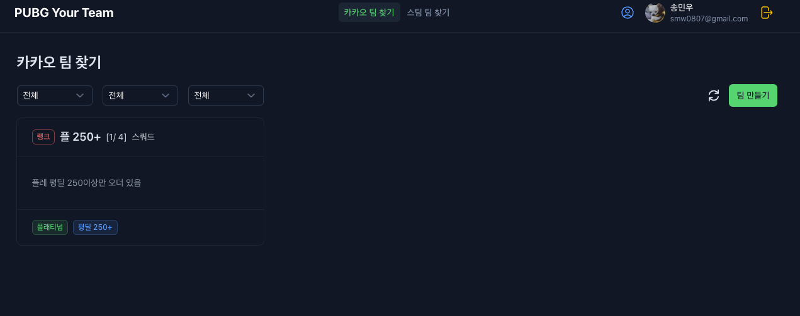
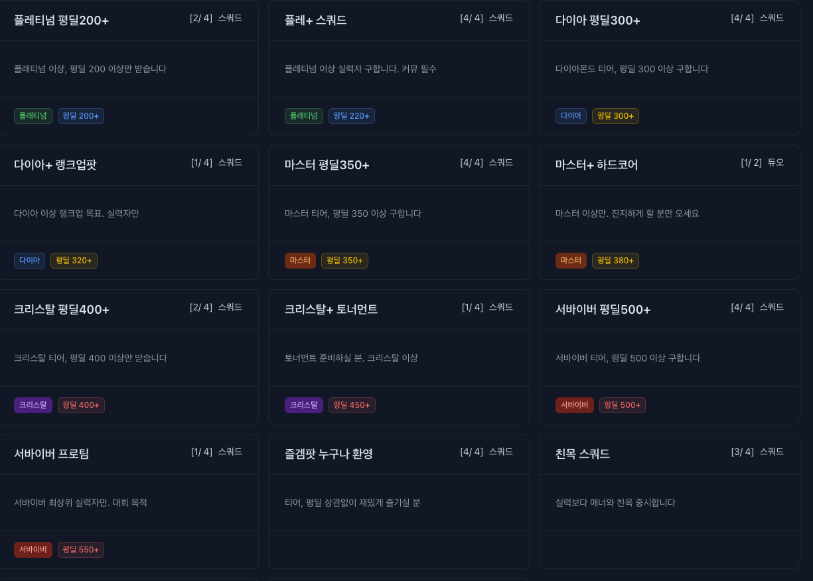
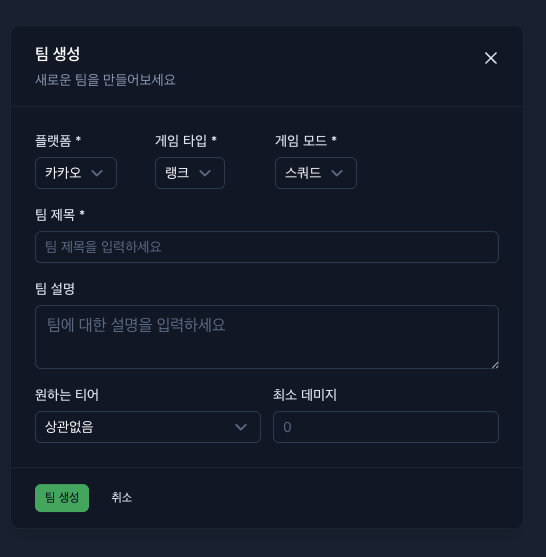
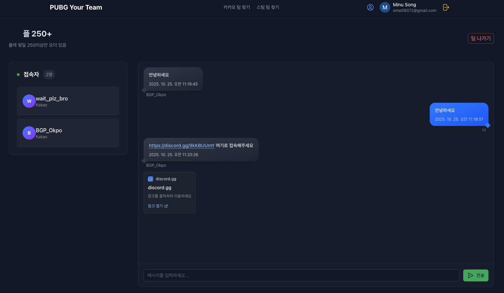
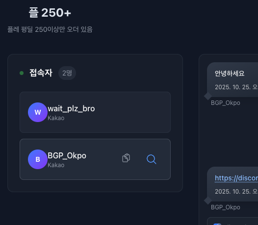
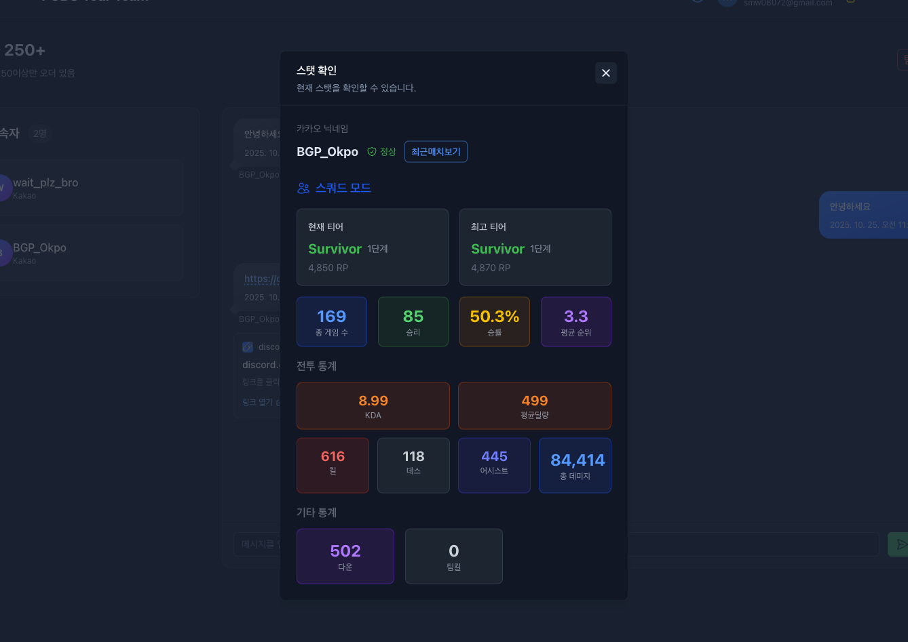

# PUBG Your Team

PUBG 플레이어들을 위한 팀 매칭 플랫폼입니다. 플레이어들이 자신의 실력과 선호도에 맞는 팀을 찾고, 실시간 채팅을 통해 소통할 수 있는 웹 애플리케이션입니다.

## 🎮 주요 기능

### 팀 매칭

- **플랫폼별 팀 검색**: 카카오/스팀 플랫폼별로 팀 검색
- **필터링 시스템**: 게임 타입(랭크/일반), 게임 모드(듀오/스쿼드), 티어별 필터링
- **팀 생성**: 원하는 조건으로 팀 생성 및 관리
- **실시간 팀 참여**: 팀에 참여하고 나가기

### 사용자 프로필

- **Google 로그인**: 간편한 소셜 로그인
- **프로필 관리**: 스팀/카카오 닉네임 등록
- **통계 조회**: PUBG API를 통한 플레이어 통계 확인
- **티어 정보**: 현재 티어, 최고 티어, 랭크 포인트 등

### 실시간 채팅

- **팀 채팅**: 팀원들과 실시간 채팅
- **메시지 히스토리**: 채팅 기록 저장 및 조회
- **닉네임 복사**: 원클릭으로 게임 닉네임 복사

## 🛠 기술 스택

### Frontend

- **Nuxt 4**: Vue.js 기반 풀스택 프레임워크
- **Vue 3**: Composition API 사용
- **TypeScript**: 타입 안정성
- **Tailwind CSS**: 유틸리티 퍼스트 CSS 프레임워크
- **Nuxt UI**: 컴포넌트 라이브러리
- **Pinia**: 상태 관리

### Backend & Database

- **Firestore**: NoSQL 실시간 데이터베이스

### External APIs

- **PUBG API**: 플레이어 통계 및 매치 데이터

### Development Tools

- **ESLint**: 코드 품질 관리
- **Vercel**: 배포 플랫폼
- **Yarn**: 패키지 매니저

## 📁 프로젝트 구조

```
app/
├── assets/           # 정적 자산
│   ├── css/         # 스타일시트
│   └── mock/        # 목업 데이터
├── components/       # Vue 컴포넌트
│   ├── Chat/        # 채팅 관련 컴포넌트
│   ├── Header/      # 헤더 컴포넌트
│   ├── Home/        # 홈페이지 컴포넌트
│   ├── Modal/       # 모달 컴포넌트
│   ├── Stats/       # 통계 컴포넌트
│   └── Team/        # 팀 관련 컴포넌트
├── composables/      # Vue Composition API
│   ├── useAlert.ts  # 알림 관리
│   ├── useAuth.ts   # 인증 관리
│   ├── useChat.ts   # 채팅 관리
│   ├── useConfirm.ts # 확인 다이얼로그
│   ├── useProfile.ts # 프로필 관리
│   └── useTeam.ts   # 팀 관리
├── constants/        # 상수 정의
├── layouts/          # 레이아웃 컴포넌트
├── models/           # TypeScript 타입 정의
├── pages/           # 페이지 컴포넌트
│   ├── index.vue    # 홈페이지
│   ├── room/[id].vue # 팀 채팅방
│   └── teams/[platform].vue # 팀 목록
├── store/           # Pinia 스토어
└── utils/           # 유틸리티 함수
    ├── firebase.ts  # Firebase 설정
    ├── pubg.ts      # PUBG API 유틸리티
    └── textTransform.ts # 텍스트 변환
```

## 🚀 시작하기

### 필수 요구사항

- Node.js 18+
- Yarn 패키지 매니저
- Firebase 프로젝트
- PUBG API 키

### 설치 및 실행

1. **저장소 클론**

```bash
git clone <repository-url>
cd pubg.your_team
```

2. **의존성 설치**

```bash
yarn install
```

3. **환경 변수 설정**
   `.env` 파일을 생성하고 다음 변수들을 설정하세요:

```env
# Firebase 설정
FB_API_KEY=your_firebase_api_key
FB_AUTH_DOMAIN=your_project.firebaseapp.com
FB_PROJECT_ID=your_project_id
FB_STORAGE_BUCKET=your_project.appspot.com
FB_MESSAGING_SENDER_ID=your_sender_id
FB_APP_ID=your_app_id
FB_MEASUREMENT_ID=your_measurement_id

# PUBG API
MATCH_URL=your_pubg_api_url
API_URL=your_api_proxy_url
```

4. **개발 서버 실행**

```bash
yarn dev
```

5. **빌드**

```bash
yarn build
```

## 🔧 주요 기능 상세

### 팀 관리

- **팀 생성**: 게임 모드, 티어, 플랫폼 등을 선택하여 팀 생성
- **팀 검색**: 다양한 필터를 사용한 팀 검색
- **팀 참여/나가기**: 실시간으로 팀 참여 및 나가기

### 사용자 인증

- **Google OAuth**: Google 계정으로 간편 로그인
- **프로필 설정**: 게임 닉네임 및 기본 정보 설정
- **통계 연동**: PUBG API를 통한 실시간 통계 조회

### 실시간 채팅

- **Firestore 실시간 리스너**: 실시간 메시지 동기화

## 🌐 배포

이 프로젝트는 Vercel을 통해 배포됩니다:

```bash
# Vercel CLI를 통한 배포
vercel --prod
```

## 📝 API 연동

### PUBG API

- 플레이어 통계 조회
- 매치 데이터 분석
- 티어 및 랭크 정보

### Firebase

- 사용자 인증
- 실시간 데이터베이스
- 클라우드 함수 (선택사항)

## 🤝 기여하기

1. Fork the Project
2. Create your Feature Branch (`git checkout -b feature/AmazingFeature`)
3. Commit your Changes (`git commit -m 'Add some AmazingFeature'`)
4. Push to the Branch (`git push origin feature/AmazingFeature`)
5. Open a Pull Request

## 📄 라이선스

이 프로젝트는 MIT 라이선스 하에 배포됩니다. 자세한 내용은 `LICENSE` 파일을 참조하세요.

## 📞 문의

프로젝트에 대한 문의사항이나 버그 리포트는 Issues를 통해 제출해 주세요.  
또는 smw0807@gmail.com 으로 이메일을 보내주세요.

---

**PUBG Your Team** - 함께하는 배틀그라운드의 시작

# 구현 화면

## 메인 화면

### 로그인 전



### 로그인 후



## 사용자 게임 닉네임 설정


로그인 후 우측 상단에 사용자 정보 왼쪽의 아이콘을 선택하면, 플레이 중인 게임 닉네임을 입력할 수 있다.

### 스탯 보기



닉네임 입력 후 오른쪽의 돋보기 아이콘을 클릭하면 해당 플레이어의 현재 시즌 스탯 정보를 확인할 수 있다.  
듀오, 스쿼드 랭크 스탯만 제공된다.

## 팀 찾기




현재 만들어진 팀 목록을 확인할 수 있다.

## 팀 만들기


함께할 팀원의 조건을 설정해서 팀을 생성할 수 있다.

- 플랫폼 : 카카오, 스팀
- 게임 타입 : 랭크, 일반
- 게임 모드 : 듀오, 일반
- 원하는 티어 : 상관없음, 브론즈, ~ , 서바이버
- 최소 데미지 : 숫자입력

이렇게 구성되어 있다.

## 팀 참가



현재 팀 방에 접속 중인 사용자를 볼 수 있고, 채팅을 통해 소통을 할 수 있다.

### 닉네임 복사 및 스탯 검색



접속자에 마우스를 올리면 닉네임 복사와 스탯 보기 버튼이 활성화 된다.  
닉네임 복사 시 클립보드에 복사가 된다.



스탯 보기 클릭시 해당 접속자의 닉네임을 조회해 스탯 정보를 제공한다.  
최근매치보기를 선택하면 이전에 만들었던 [스탯 및 매치 분석](https://pubg-stats-dashboard.vercel.app/) 페이지로 이동해 바로 결과를 보여준다.
